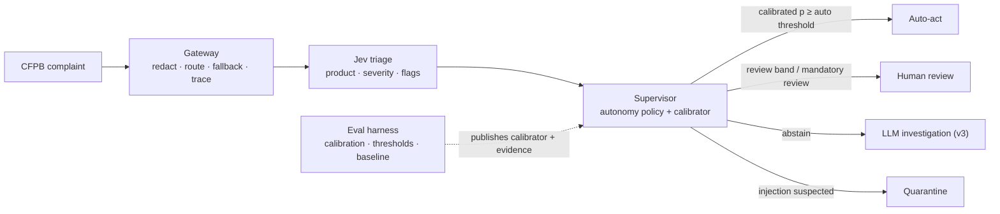

# ConductOS

**Governed autonomous operations for financial services.**
Fast System One decisions on every case, LLM reasoning only for the hard ones, and humans in the loop wherever confidence or risk demands it.

> Portfolio project by **Tanmay Mohanta**, Applied AI & AI Platform PM.
> Site: <https://tanmaymba20272-ai.github.io> · PRDs and PM docs: Notion workspace (link on the site)

---

## The problem

Bank operations teams read huge volumes of free text, such as customer complaints and monitoring alerts, and make the same decisions thousands of times a day. Every decision has to be explainable to a regulator. Keyword rules are brittle. Chat-style LLMs are slow and costly per decision, and they can't reliably say when they're unsure, so they can't be trusted to act alone.

## The bet

| | System One: [Jev](https://typesafe.ai) | System Two: LLM agents |
|---|---|---|
| Job | Typed decisions: classify, score, flag, route | Investigate, reason, draft |
| Runs on | **Every** case | Only cases System One escalates |
| Output | Typed values + full probability distribution | Text, checked by verifiers |

**Autonomy is earned per action, with evidence, and revoked automatically.** The vendor's "confidence" score measures how concentrated the probabilities are. It is *not* a calibration guarantee, per [TypeSafe's own docs](https://docs.typesafe.ai/confidence). So ConductOS measures calibration on real labels, recalibrates, and only lets an agent act alone above a threshold whose **lower 95% confidence bound** on precision meets the target.

## Architecture



## Repository map: one product, three pillars

| Pillar | Folder | What's here now | PM proof |
|---|---|---|---|
| **A · Agentic Gateway** | [`conductos/gateway`](conductos/gateway) | Vendor-neutral decision contract, Jev and rules backends, fallback chain, PII redaction, kill switch, trace log | API-first platform design, cost/latency trade-offs, vendor hedging |
| **B · Ops Pod** | [`conductos/ops_pod`](conductos/ops_pod) | Triage agent, typed contracts, case state machine, deterministic supervisor, [autonomy policy](policy/autonomy.yaml) | Agent topology, state machines, contracts, human-agent collaboration |
| **C · Eval Harness** | [`conductos/eval_harness`](conductos/eval_harness) | Reliability bins, ECE, Brier, cross-fitted isotonic recalibration, Wilson-bound thresholds, keyword baseline | Statistical rigor under AI non-determinism |

Data: real consumer complaint narratives from the [CFPB narratives archive](https://www.consumerfinance.gov/foia-requests/foia-electronic-reading-room/cfpb-consumer-complaint-database-narratives-archive/). The CFPB stopped publishing narratives in its live database on 14 August 2026, so ConductOS builds a **fixed, seeded golden sample** of 1,000 complaints from the archive (`data/golden/`). Every model version is evaluated on the same cases, so a change in the numbers means the model changed, not the data.

## Run it

```bash
python -m venv .venv && source .venv/bin/activate
pip install -e ".[dev]"
cp .env.example .env            # add TYPESAFE_API_KEY. Never commit .env
pytest -q                       # runs offline, no key needed
conductos build-sample --n 1000 # one-off: download a CFPB archive export, seeded sample (skip if data/golden exists)
conductos skeleton --n 500      # rules baseline → Jev triage → evaluation
cat results/latest.md
```

A 500-complaint run costs a few cents of Jev usage at list price.

The `harness` GitHub Action runs the same pipeline monthly and commits `results/public.json`. The portfolio site reads that file, so the published numbers are always the latest real run.

## Status and honest caveats

- **Walking skeleton.** Real data, real model and real statistics, end to end. LLM investigation agents, the review UI and the semantic cache are on the [roadmap](#roadmap).
- **Labels are noisy.** CFPB product labels are chosen by consumers when they file a complaint. Accuracy is measured against that proxy, not true ground truth.
- **Some signals are unlabeled.** Severity, vulnerability and regulatory-risk flags have no ground truth yet. Only their distributions are reported until a hand-labeled golden set exists.
- **Unpublished thresholds mean no autonomy.** Until the harness publishes a calibrated threshold, every case routes to human review.

## Roadmap

1. **Prove the decision layer.** Calibration on 500+ complaints, compared against the keyword baseline. *(now)*
2. **Governed autonomy.** Review queue, promotion and demotion, OpenTelemetry tracing, quotas.
3. **Hard cases.** LLM investigator, resolution and compliance agents with verifiers, plus a themes dashboard.
4. **Platform reuse.** An AML alert investigation module (IBM AMLworld and SAML-D data) on the same three pillars.

## Docs

The PRDs, strategy, opportunity solution tree, metrics spec, risk register, red-team review and decision log are in Notion and indexed in [`docs/`](docs/README.md).

License: MIT
